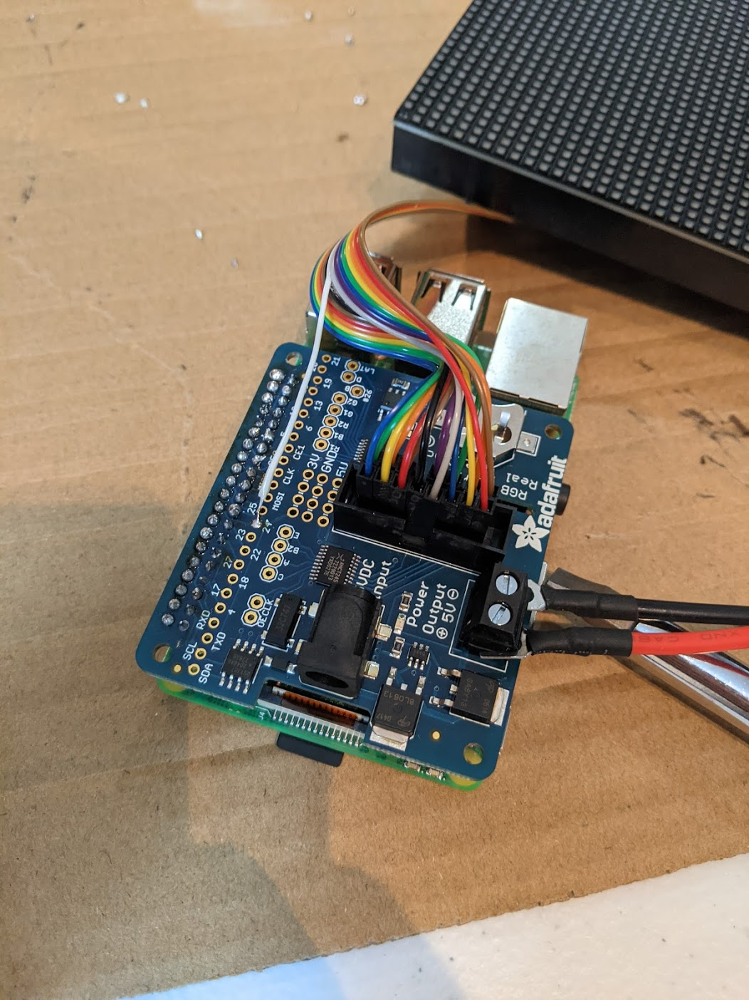
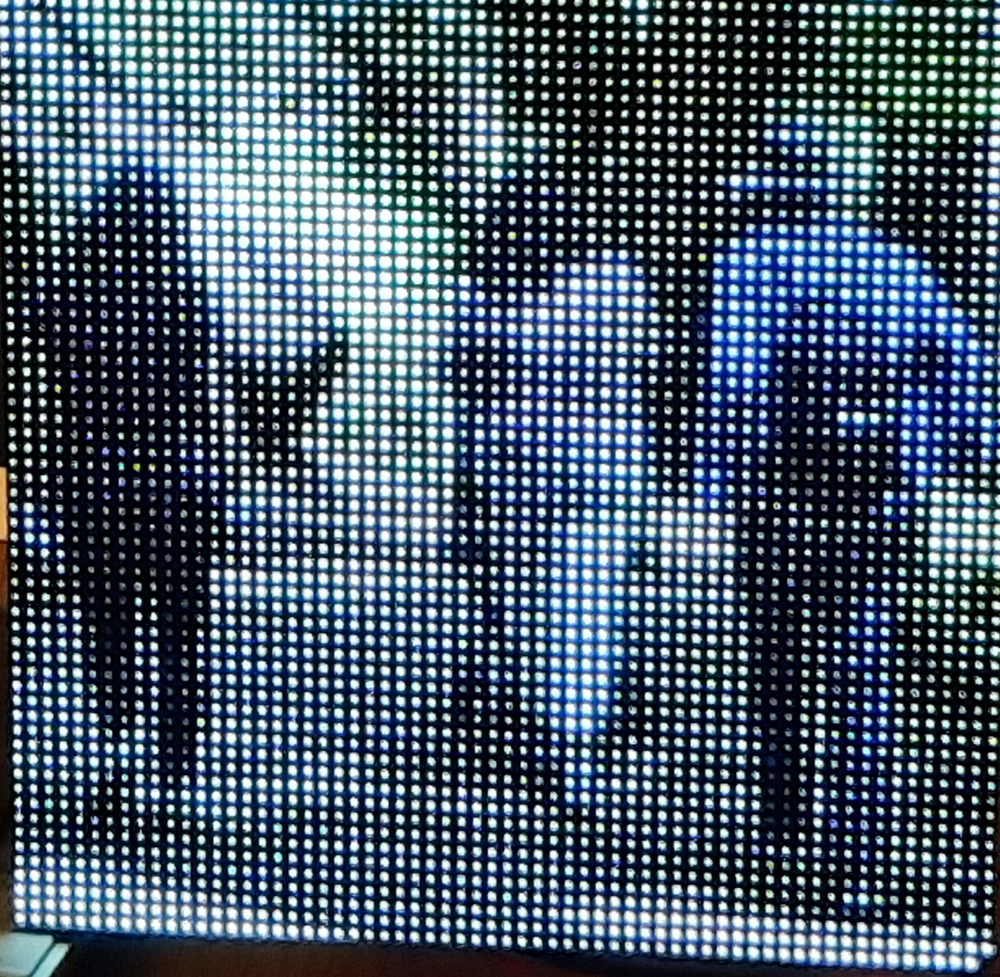

# audio-viz-pi

Audio visualization for raspberry pi

## Materials
- Purchase everything from [this guide](https://www.hackster.io/gatoninja236/raspberry-pi-audio-spectrum-display-1791fa#things) except for the `DFRobot ESP32 FireBeetle` chip.
- Assemble following the adafruit guide [here](https://learn.adafruit.com/adafruit-rgb-matrix-plus-real-time-clock-hat-for-raspberry-pi/assembly). One tricky thing is sodering the white wire from the rainbow cable to the 24 GPIO pin. You can see an image of this below.
- You'll also need a usb microphone. I used [this one](https://www.amazon.com/gp/product/B08M37224H/ref=ppx_yo_dt_b_search_asin_image?ie=UTF8&psc=1).

## Results

1. Audio Processing 
- You can display the frequency steptrum of audio in near real-time as shown below.

1. Images
- With the 64x64 matrix hooked up to the pi, you can also display images such as this image of a walk in the woods.

## Install

- All on your raspberry pi

1. Follow the instructions here <https://github.com/hzeller/rpi-rgb-led-matrix/tree/master/bindings/python>
2. Install `apt-get libasound2-dev` on your raspberry pi
3. Install Poetry `bash curl -sSL https://raw.githubusercontent.com/python-poetry/poetry/master/get-poetry.py | python`
4. Install poetry dependencies `bash poetry install`

## Run
This should all be run on your raspbrerry pi

1. `bash sudo python3 -m run_audio_processing`

- This uses two threads to read in audio data pushed to a queue. Then, we read data from the queue and pass it to the visuzliation program.

2. `bash sudo ./run_audio_processing.sh`

- This passes in audio data using a named pip from ffmeg to `spectrum_matrix.py`

